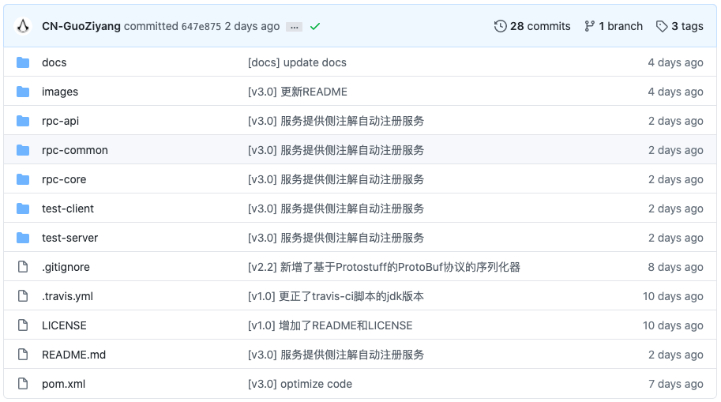

## 前言

差不多五月份左右，我开始准备秋招。除了每天刷题或者复习，就得开始准备准备项目了。因为我主要是Java后端，项目是很好找的，主要就是各种管理系统和商城项目。于此同时，我也在思考，怎么可以准备一个更加出彩的、与众不同的项目，可以直接引导你与面试官的聊天方向？直到，我看到了[Guide哥](https://github.com/Snailclimb)的[RPC框架](https://github.com/Snailclimb/guide-rpc-framework)，眼前一亮。

众所周知，用框架和写框架所需要的对框架的熟悉程度显然不在一个级别。如果你能亲手写一个RPC框架，那么几乎所有的RPC相关的问题就很难问倒你了（除非是具体到某个框架）。于是，我开始研究这个项目。

苦于Guide哥没有写教程，我只能按照commits历史，一点一点揣测每一点变化的意义，并且临摹下来（照葫芦画瓢），当然，在临摹过程中，我还是有很多自己的想法的，例如自定义协议、以及序列化与负载均衡算法可配置、注解方式服务发现等。感兴趣的同学可以照着这个教程自行完成一个。

## 介绍

介绍其实没有什么，主要还是Readme里那一套，详见上一章Readme。

这个教程和Guide哥的commits一样，是循序渐进的，从一个最简单的BIO + Java序列化开始，逐步完善成Netty + 多序列化方式的比较完整的框架，并且配置了Nacos服务发现（没用Zookeeper的原因仅仅是因为我不会）。

在每一章节的开头，我都会放出该章节对应的commit地址，方便查看代码。

整个项目位于https://github.com/CN-weijialu/My-RPC-Framework

## 项目结构

- docs文件夹：这个文档的源文件
- images文件夹：Readme所用到的图片（其实只有一张）
- rpc-api文件夹：服务端与客户端的公共调用接口
- rpc-common文件夹：项目中的一些通用的枚举类和工具类
- rpc-core文件夹：框架的核心实现
- test-client文件夹：测试用的客户端项目
- test-server文件夹：测试用的服务端项目
- .gitignore：就是.gitignore
- .travis.yml：持续集成的脚本（其实什么也没干）
- LICENSE：基于MIT开源协议哦
- README.md：就是Readme
- pom.xml：项目的总的pom

## 开发环境

- macOS Catalina 10.15.5
- Java SE 1.8.0_231
- JetBrain IntelliJ IDEA